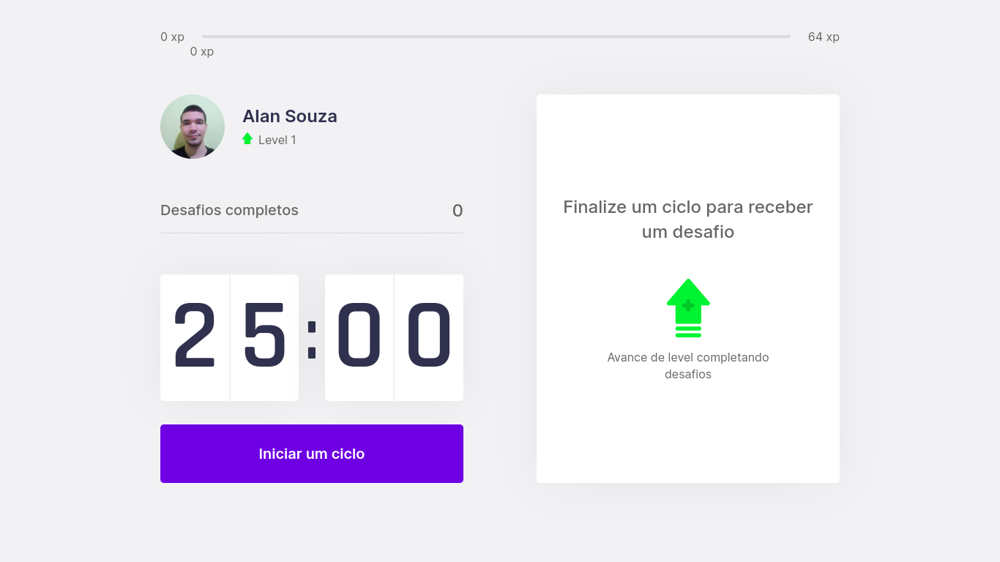

<h1 align="center">Move.it</h1>



<br>

# Sobre o Projeto

O Move.it veio para te lembrar de se exercitar sempre!

No Move.it você usa a técnica pomodoro, em que você trabalha em ciclos de 25 minutos com intervalo de 5 minutos. Mas você troca esses 5 minutos por um exercício para o corpo ou para visão.

Este projeto foi desenvolvido na NLW#4, apresentada pela Rocketseat.

# Tecnologias

Este projeto foi desenvolvido usando as seguintes tecnologias:

- [Next.js](https://nextjs.org/)
- [React](https://reactjs.org)
- [TypeScript](https://www.typescriptlang.org/)

# Rodando o Projeto

## Requisitos:
- Node.js 18

Clone o projeto:

```bash
git clone https://github.com/alansouza1/moveit.git
```

Acesse a pasta:

```bash
cd moveit
```

Instale as depndências:
```bash
npm install
```

Inicie o projeto:
```bash
npm run dev
```

Para visualisar o projeto acesse a rota http://localhost:3000.

# Licença

Este projeto está licenciado sob a licença MIT. Vejo o arquivo [LICENSE](LICENSE) para detalhes.

---

<p align="center">Feito por Alan Souza</p>
